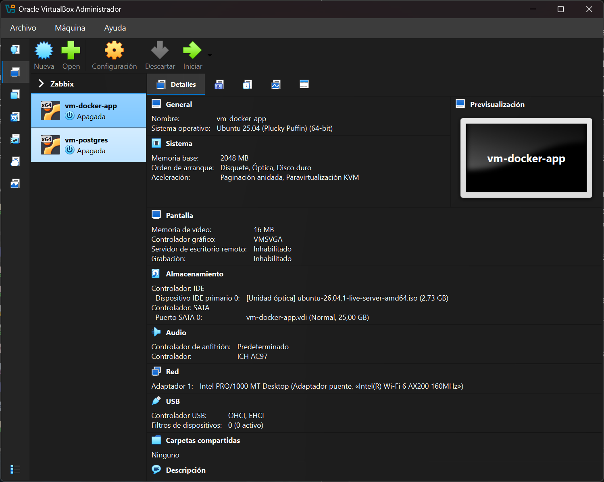
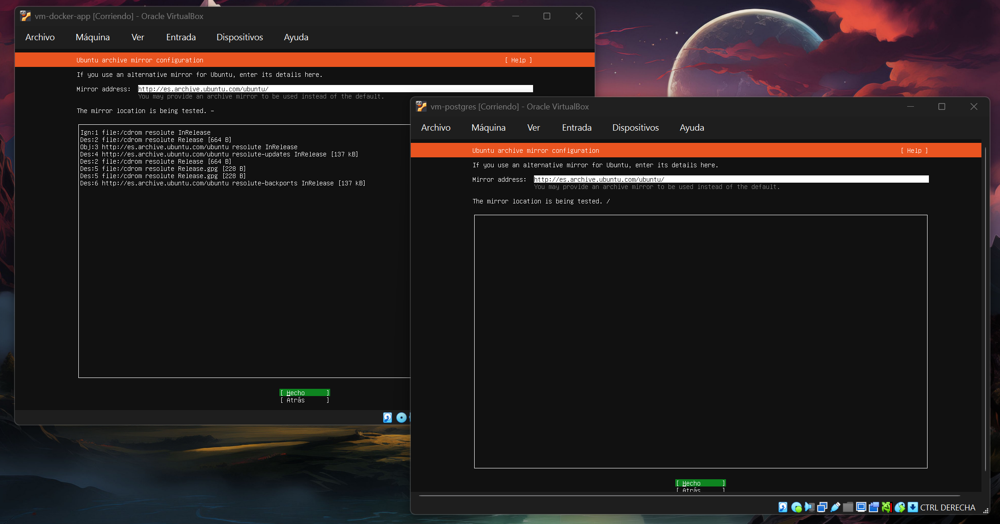
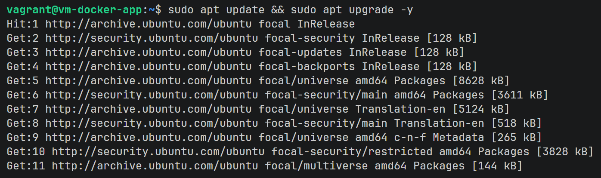
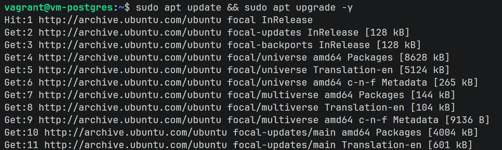
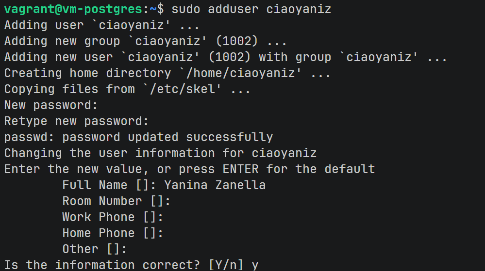
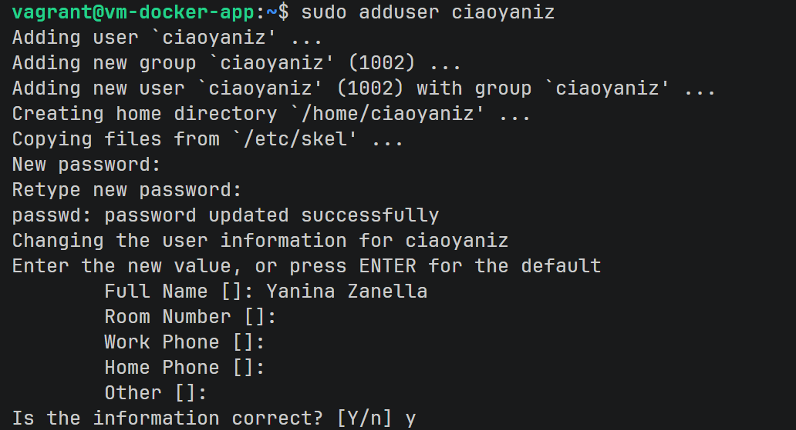
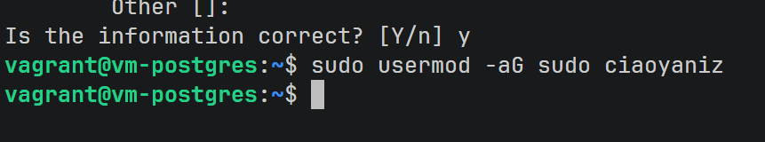
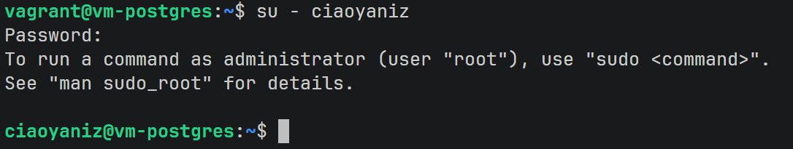

## crear las dos VMs

Cada VM contiene:
- VM 1 (Docker + app)
- VM 2 (PostgreSQL)



**Red**: en modo Bridged, la VM se comporta como una máquina más de la red local, para poder ver a la otra VM por IP.

Instalación de las dos VMs:



## Actualización del sistema:

al principio lo estaba haciendo con BOXES de Vagrant pero tuve errores al instalar PostgreSQL asique repetí esos pasos con VM reinstaladas con la ISO oficial de Ubuntu 24.




## creación de users:

vagrant ya viene con un user por defecto llamado vagrant pero a terminos practicos voy a crear otro nuevo



en ambas vms he creado mi user



agrego en ambas vms mi user para que pueda acceder con sudo



sigo trabajando con mi user



## Configurar POSTGRES v18:

instalación del repo oficial version 18

```bash
sudo apt install -y curl ca-certificates gnupg lsb-release
sudo install -d /usr/share/postgresql-common/pgdg
sudo curl -o /usr/share/postgresql-common/pgdg/apt.postgresql.org.asc --fail https://www.postgresql.org/media/keys/ACCC4CF8.asc
sudo sh -c 'echo "deb [signed-by=/usr/share/postgresql-common/pgdg/apt.postgresql.org.asc] https://apt.postgresql.org/pub/repos/apt $(lsb_release -cs)-pgdg main" > /etc/apt/sources.list.d/pgdg.list'
sudo apt update
sudo apt install -y postgresql-18
```

